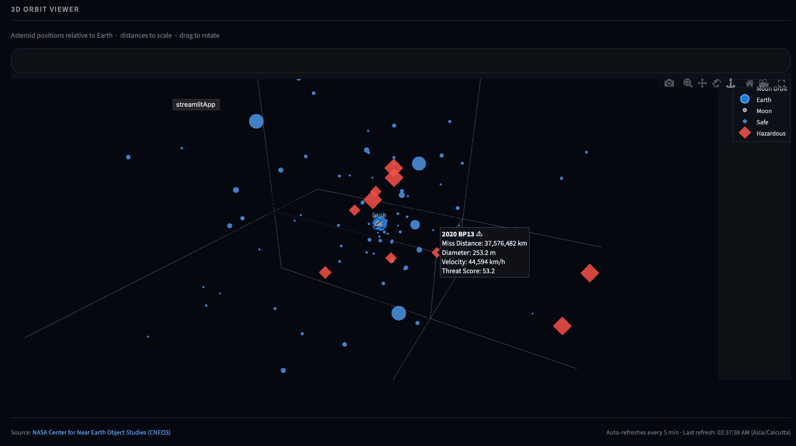
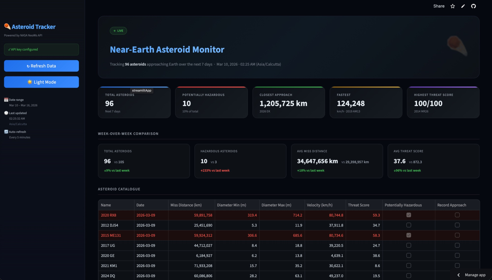
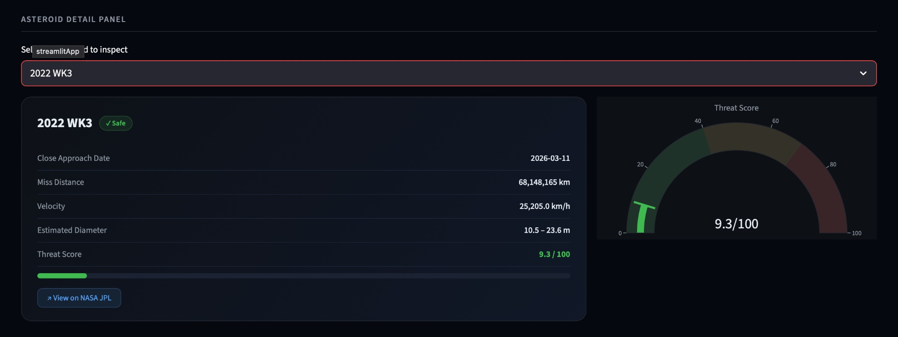

# ☄️ Near-Earth Asteroid Monitor

> A live analytics dashboard tracking every asteroid approaching Earth over the next 7 days — powered by NASA's NeoWs API. Features a custom threat scoring model, week-over-week comparisons, an asteroid detail panel, and an interactive 3D orbit viewer.

🚀 **Live app:** [nearearthwatch.streamlit.app](https://nearearthwatch.streamlit.app)

---

## 📸 Preview

### 3D Orbit Viewer


### Main Dashboard


### Asteroid Detail Panel


---

## ✨ Features

### 🔴 Live KPI Cards
Five summary cards refresh every 5 minutes with real-time data:
- **Total Asteroids** — count of NEOs approaching in the next 7 days
- **Potentially Hazardous** — how many NASA has flagged as dangerous
- **Closest Approach** — the nearest flyby and which asteroid it is
- **Fastest** — top velocity in km/h and the asteroid name
- **Highest Threat Score** — the most dangerous object by custom scoring

### 🧮 Custom Threat Score (0–100)
A proprietary risk formula weighting:
- **Proximity** — 40%
- **Size** — 35%
- **Velocity** — 25%
- With a **1.4× multiplier** applied to NASA-flagged hazardous asteroids

Shown as a column in the asteroid table and as a standalone KPI card.

### 📊 Week-over-Week Comparison
Fetches the previous 7 days from NASA and displays 4 delta cards:
- Total asteroids · Hazardous count · Avg miss distance · Avg threat score
- Color-coded arrows showing increase or decrease vs last week

### 🔍 Asteroid Detail Panel
Select any asteroid from a dropdown to see:
- Full metrics — miss distance, diameter, velocity, threat score
- Hazard badge (Safe / Hazardous)
- Animated threat gauge (green / amber / red)
- Direct link to NASA JPL's close approach data

### ⭐ Record Close Approach Detection
Fetches full historical close-approach data for the 5 nearest asteroids. If the current flyby is within 1% of their all-time closest approach, they are flagged with a **Record Close Approach** badge in the table and detail panel.

### 🌍 3D Orbit Viewer
An interactive Plotly 3D scene showing:
- Earth at centre, Moon orbit ring as a reference
- All asteroids plotted at their actual miss distances
- Marker size = diameter · color/shape = hazard status
- Full hover tooltips with miss distance, diameter, velocity, and threat score
- Drag to rotate · scroll to zoom

### 📈 Analytics Charts
- Diameter vs. Miss Distance scatter plot (color-coded by hazard status)
- Asteroids per Day stacked bar chart
- Velocity Distribution by Day box plot

---

## 🛠️ Tech Stack

| Tool | Purpose |
|---|---|
| Python | Core language |
| Streamlit | Web dashboard framework |
| Plotly | Interactive 2D and 3D charts |
| Requests | NASA API calls |
| NASA NeoWs API | Near-Earth Object data (CNEOS) |

---

## ⚙️ Installation

### 1. Clone the repository

```bash
git clone https://github.com/shrek6201/near-earth-asteroid-monitor.git
cd near-earth-asteroid-monitor
```

### 2. Install dependencies

```bash
pip install -r requirements.txt
```

### 3. Get a NASA API key

Sign up for free at [api.nasa.gov](https://api.nasa.gov). You'll receive your key by email instantly.

### 4. Set your API key

Set it as an environment variable:

```bash
export NASA_API_KEY=your_api_key_here
```

Or enter it directly in the app's sidebar when the app loads.

### 5. Run the app

```bash
streamlit run app.py
```

The dashboard will open in your browser at `http://localhost:8501`.

---

## 🔐 Deploying on Streamlit Cloud

1. Push your code to GitHub
2. Go to [share.streamlit.io](https://share.streamlit.io) and connect your repo
3. Under **Advanced Settings → Secrets**, add:
```toml
NASA_API_KEY = "your_api_key_here"
```
4. Deploy — your API key stays secure and never appears in the UI

---

## 📡 Data Source

This project uses NASA's **NeoWs (Near Earth Object Web Service)** API, maintained by the **Center for Near Earth Object Studies (CNEOS)** at NASA's Jet Propulsion Laboratory.

- API docs: [api.nasa.gov](https://api.nasa.gov)
- Free tier: up to 1,000 requests/hour
- Data auto-refreshes every 5 minutes in the live app

---

## 📂 Project Structure

```
near-earth-asteroid-monitor/
├── app.py               # Main Streamlit app
├── api.py               # NASA API fetch logic
├── charts.py            # Plotly chart functions
├── requirements.txt     # Python dependencies
└── README.md
```

---

## 🤝 Contributing

Contributions are welcome! Feel free to open an issue or submit a pull request for new features, bug fixes, or UI improvements.

---

## 📄 License

This project is licensed under the MIT License. See [LICENSE](LICENSE) for details.

---

## 🙏 Acknowledgements

- [NASA Open APIs](https://api.nasa.gov) for free access to real-time planetary data
- [Streamlit](https://streamlit.io) for making data apps easy to build and deploy
- [Plotly](https://plotly.com) for powerful interactive visualizations
