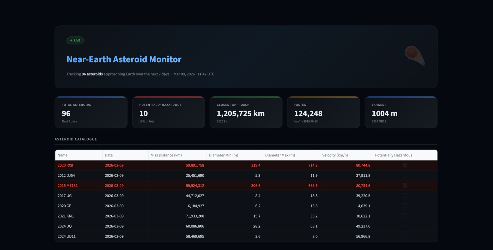

# ☄️ Near-Earth Asteroid Monitor

> An interactive dashboard for tracking Near-Earth Asteroids (NEAs) in real-time using NASA's NeoWs API. Visualize upcoming flybys, miss distances, asteroid sizes, and potential hazard status — built with Python and Streamlit.

---

## 🚀 Features

- 📅 **7-day flyby forecast** — fetches all asteroids approaching Earth in the next 7 days
- 📊 **Interactive charts** — scatter plots and bar charts built with Plotly
- ⚠️ **Hazard classification** — instantly see which asteroids are flagged as potentially dangerous by NASA
- 📋 **Sortable data table** — browse asteroid name, miss distance, diameter, velocity, and approach date
- 🌑 **Dark-themed UI** — clean, space-inspired interface

---

## 📸 Preview



---

## 🛠️ Tech Stack

| Tool | Purpose |
|---|---|
| Python | Core language |
| Streamlit | Web dashboard framework |
| Plotly | Interactive charts |
| Requests | NASA API calls |
| NASA NeoWs API | Near-Earth Object data |

---

## ⚙️ Installation

### 1. Clone the repository

```bash
git clone https://github.com/your-username/near-earth-asteroid-monitor.git
cd near-earth-asteroid-monitor
```

### 2. Install dependencies

```bash
pip install -r requirements.txt
```

### 3. Get a NASA API key

Sign up for free at [api.nasa.gov](https://api.nasa.gov). You'll receive your key by email instantly.

### 4. Set your API key

You can either set it as an environment variable:

```bash
export NASA_API_KEY=your_api_key_here
```

Or enter it directly in the app's sidebar when prompted.

### 5. Run the app

```bash
streamlit run app.py
```

The dashboard will open in your browser at `http://localhost:8501`.

---

## 📡 Data Source

This project uses NASA's **NeoWs (Near Earth Object Web Service)** API — a RESTful API for searching and browsing near-Earth asteroid data maintained by NASA's Jet Propulsion Laboratory (JPL).

- API Docs: [api.nasa.gov](https://api.nasa.gov)
- Data updates daily
- Free tier allows up to 1,000 requests/hour

---

## 📂 Project Structure

```
near-earth-asteroid-monitor/
├── app.py               # Main Streamlit app
├── api.py               # NASA API fetch logic
├── charts.py            # Plotly chart functions
├── requirements.txt     # Python dependencies
└── README.md
```

---

## 🌍 Example Queries

Once the app is running, you can explore:

- Which asteroid is passing closest to Earth this week?
- How many potentially hazardous asteroids are approaching in the next 7 days?
- What's the size distribution of upcoming flybys?

---

## 🤝 Contributing

Contributions are welcome! Feel free to open an issue or submit a pull request for new features, bug fixes, or UI improvements.

---

## 📄 License

This project is licensed under the MIT License. See [LICENSE](LICENSE) for details.

---

## 🙏 Acknowledgements

- [NASA Open APIs](https://api.nasa.gov) for providing free access to planetary data
- [Streamlit](https://streamlit.io) for making data apps ridiculously easy to build
- [Plotly](https://plotly.com) for beautiful interactive visualizations
